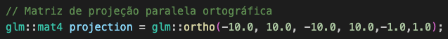
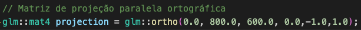
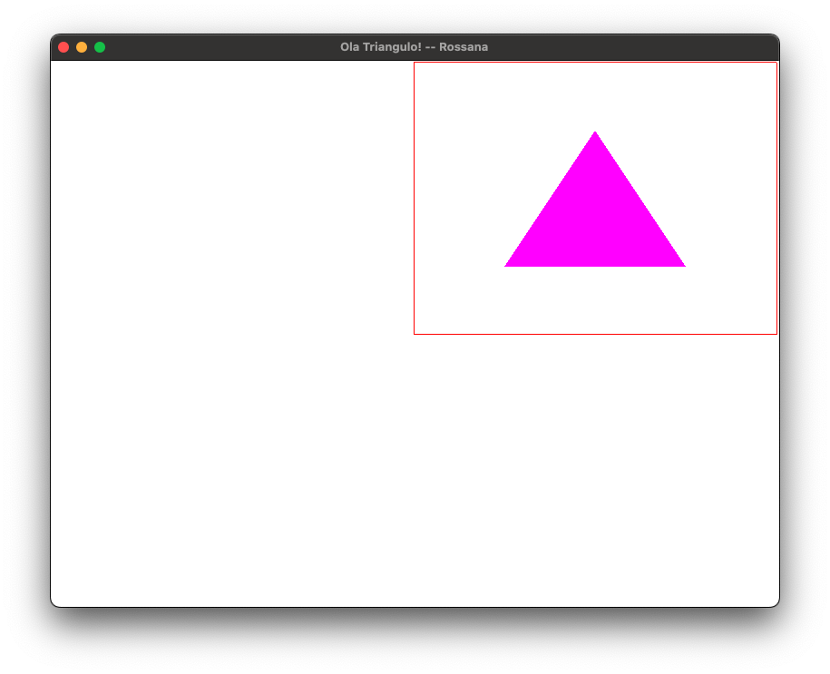
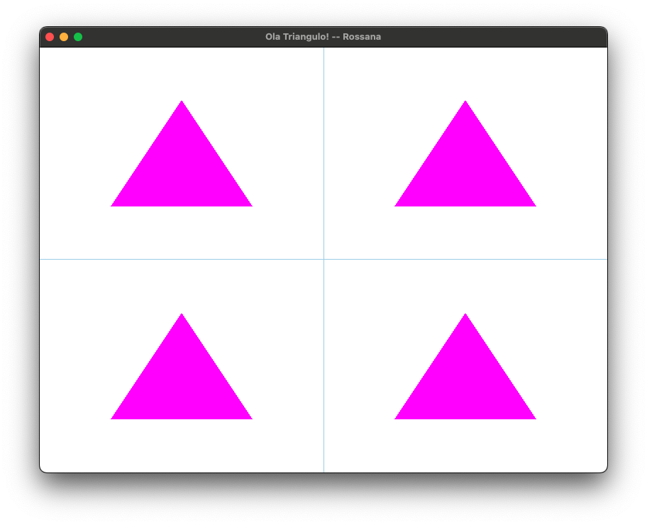

**1. Modifique a janela do mundo (window/ortho) para os limites: xmin=-10, xmax=10, ymin=-10, ymax=10.**

**2. Agora modifique para: xmin=0, xmax=800, ymin=600, ymax=0. De preferência, comente/remova o código de correção de aspecto**

**3. Utilizando a câmera 2D do exercício anterior, desenhe algo na tela. O que acontece quando posicionamos os objetos? Por que é útil essa configuração?**

Essa configuração é útil para definirmos as extremidades(mínima e máxima) de x e y. Assim, podemos posicionar os objetos de forma mais precisa. Quando posicionamos os objetos, eles são desenhados de acordo com a posição que foi definida. Se a posição for fora do range definido, o objeto não será visível.

Os exercícios 4 e 5 foram feitos utilizando a câmera 2D do exercício anterior.

**4. Modifique o viewport para desenhar a cena apenas no seguinte quadrante da janela da aplicação:**

**5 .Agora, desenhe a mesma cena nos 4 quadrantes.**

