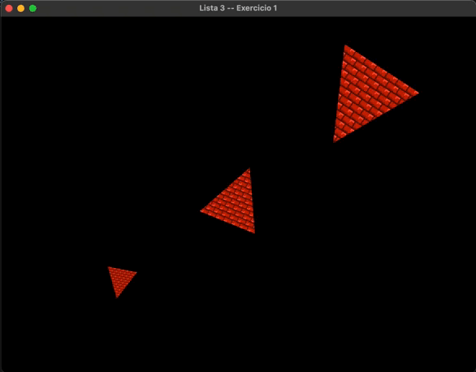
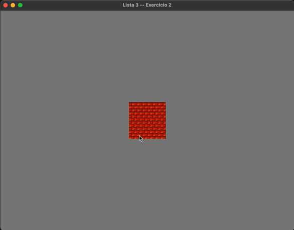

**1. Desenhe uma mesma geometria 3 vezes na tela, aplicando transformações diferentes (mesmo VAO, matrizes de transformações diferentes, 3 chamadas de desenho).**

**2. Altere a posição de uma geometria (triângulo ou retângulo) nas 4 direções (cima, baixo, esquerda e direita) utilizando comandos de teclado para o controle (WASD ou setas).**

